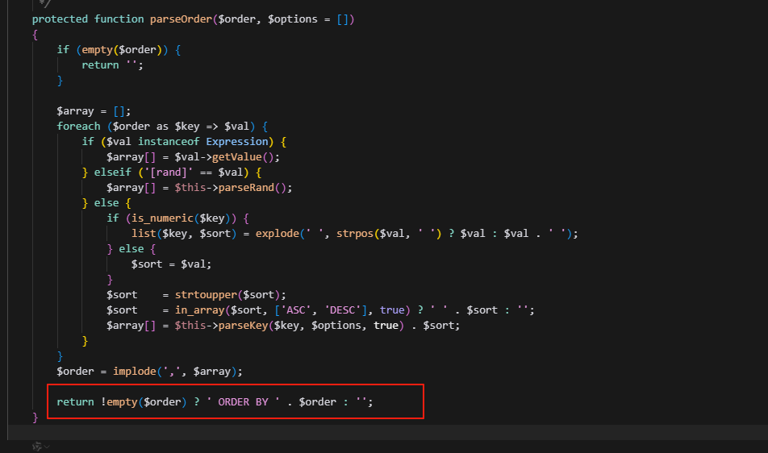

target:https://github.com/daicuo/cms
version: V1.3.13

There is an SQL injection vulnerability in the file library\think\db\Builder.php of daicuocms V1.3.13.

The location of the vulnerability is shown below:

The parameter after "order by" is not properly handled.
